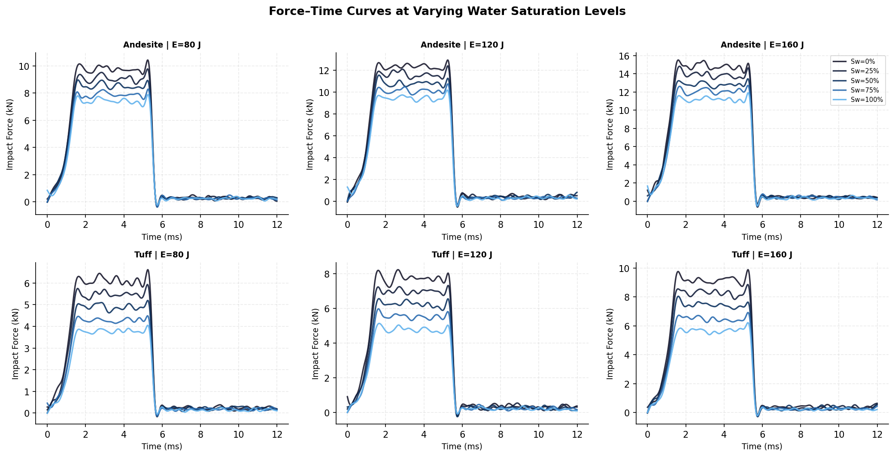
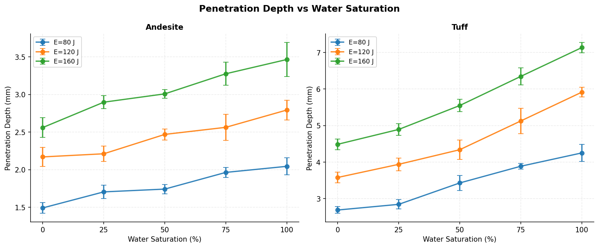
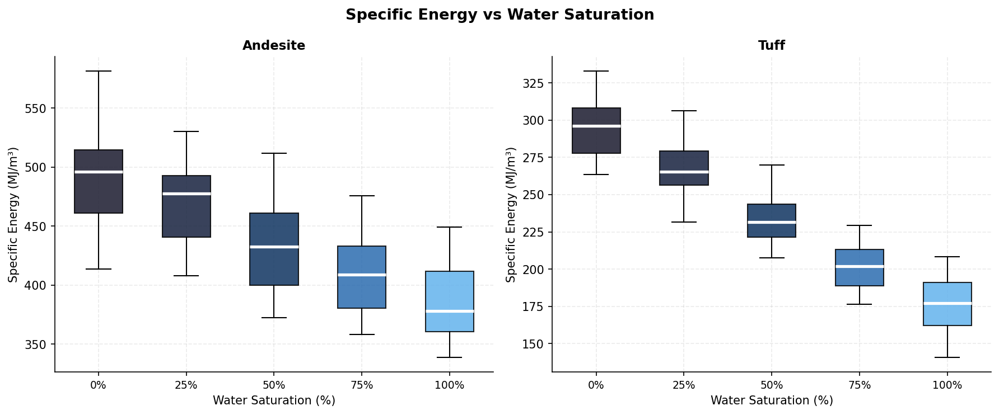
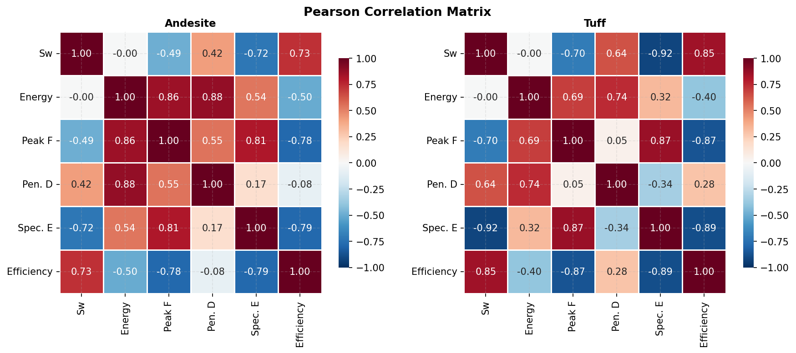
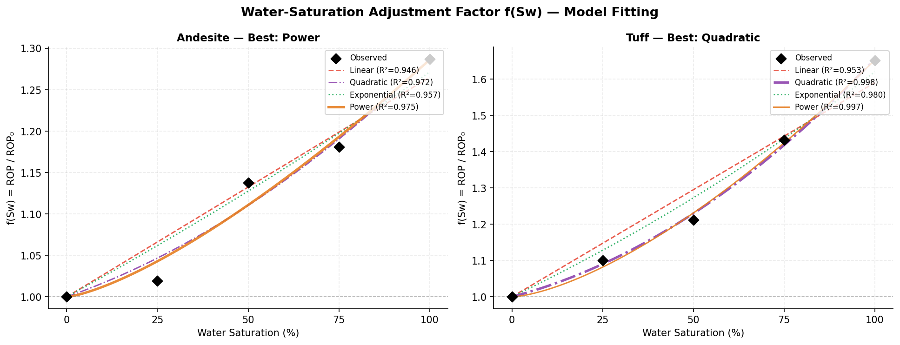
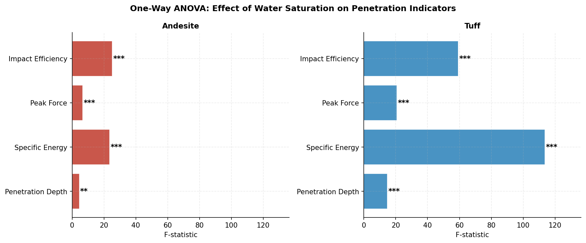

# Rock Penetration Analysis — Water-Saturation Adjustment Factor

An experimental-data-driven framework to quantify the influence of **water saturation** on rock drill bit penetration performance, and to derive an interpretable **adjustment factor** suitable for field ROP (Rate of Penetration) prediction.

---

## Research Background

In real field operations, water saturation levels in rocks vary significantly due to groundwater or rainfall. This directly affects excavation efficiency, specific energy consumption, and bit wear. While the effects of water saturation on static mechanical properties (compression, tension) are well established, their application to **dynamic percussion drilling** remains limited.

This project builds a reproducible analysis pipeline that:
1. Processes force–time curves from percussion drilling experiments
2. Extracts key penetration indicators
3. Performs statistical significance testing
4. Fits a simple, physically interpretable water-saturation adjustment factor

---

## Results

### Force–Time Curves

Filtered force–time responses under varying water saturation levels for both rock types and three impact energy levels.



---

### Penetration Depth vs Water Saturation

As water saturation increases, penetration depth increases due to reduced rock resistance, with the effect more pronounced for tuff than andesite.



---

### Specific Energy vs Water Saturation

Specific energy decreases with saturation, indicating that less energy is required to penetrate saturated rock.



---

### Correlation Analysis

Correlation matrices reveal the strength of relationships between water saturation, impact energy, and penetration performance indicators.



---

### Adjustment Factor f(Sw) — Model Fitting

Four models are fitted. The best-performing model (highest R²) is highlighted.

| Rock | Best Model | R² |
|---|---|---|
| Andesite | Power | 0.9746 |
| Tuff | Quadratic | 0.9978 |

The fitted adjustment factors are:

```
Andesite: f(Sw) = 1 + 0.2862 × Sw^1.3674
Tuff:     f(Sw) = 1 + 0.2636 × Sw + 0.3922 × Sw²
```

At full saturation (`Sw = 1.0`), the fitted adjustment factor indicates an approximate ROP increase of 28.6% for andesite and 65.6% for tuff relative to dry conditions.



---

### ANOVA Results

One-way ANOVA confirms that water saturation has a statistically significant effect on all penetration indicators for both rock types.



---

## Project Structure

```
rock-penetration-analysis/
├── run_analysis.py           # Main entry point
├── requirements.txt
├── data/
│   └── experimental_data.csv # Generated dataset
├── src/
│   ├── data_generator.py     # Synthetic data with physical basis
│   ├── signal_processing.py  # Force-time curve processing
│   ├── statistical_analysis.py
│   └── adjustment_factor.py  # f(Sw) model fitting
└── figures/                  # All output plots
```

---

## Installation

```bash
git clone https://github.com/YOUR_USERNAME/rock-penetration-analysis.git
cd rock-penetration-analysis
pip install -r requirements.txt
python run_analysis.py
```

---

## Methodology

### 1. Force–Time Curve Processing

Raw percussion force signals are filtered using a 4th-order Butterworth low-pass filter (cutoff: 2 kHz) to remove high-frequency noise while preserving impact dynamics. Peak detection and impulse integration are then applied.

### 2. Indicator Extraction

| Indicator | Description |
|---|---|
| Penetration Depth (mm) | Depth per blow under given impact energy |
| Peak Impact Force (kN) | Maximum recorded impact force |
| Specific Energy (MJ/m³) | Energy per unit volume of rock removed |
| Impact Efficiency | Penetration per unit energy input |

### 3. Statistical Analysis

- **Pearson / Spearman Correlation** between Sw and each indicator
- **One-Way ANOVA** to test whether saturation levels produce statistically significant differences
- Significance levels: `*` p<0.05, `**` p<0.01, `***` p<0.001

### 4. Adjustment Factor Fitting

Four candidate functional forms for f(Sw) are evaluated:

| Model | Formula |
|---|---|
| Linear | 1 + a·Sw |
| Quadratic | 1 + a·Sw + b·Sw² |
| Exponential | exp(a·Sw) |
| Power | 1 + a·Sw^b |

The best model is selected based on R², RMSE, and physical plausibility.

The adjustment factor is incorporated into field ROP prediction as:

```
ROP = ROP₀ × f(Sw)
```

where ROP₀ is the baseline penetration rate under dry conditions.

---

## Reference

Hashiba, K. and Fukui, K. (2024). Penetration Characteristics of a Rock Drill Bit into Rock. *Journal of MMIJ*.

---

## License

MIT
